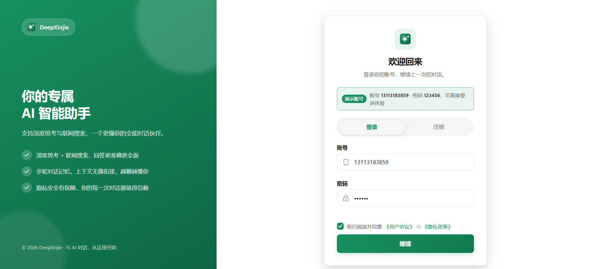
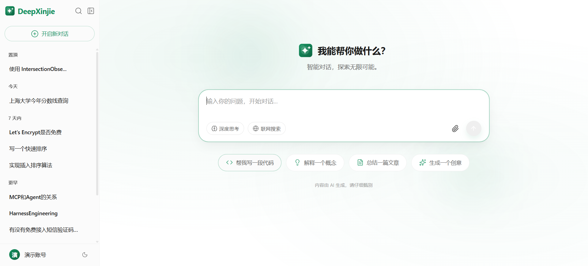
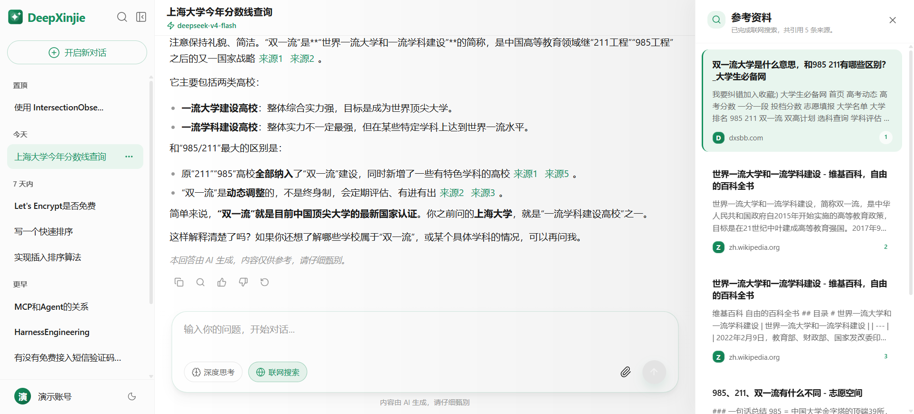
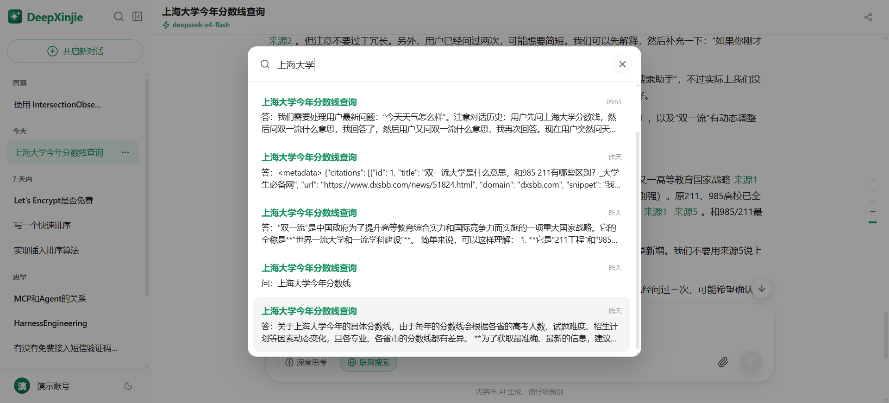
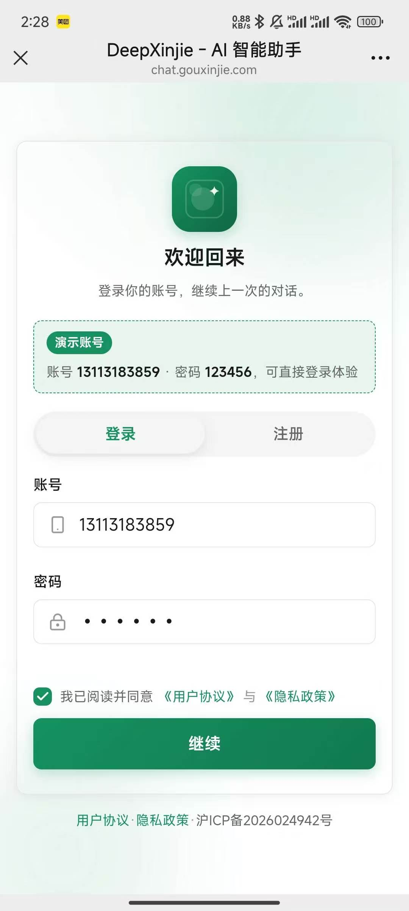
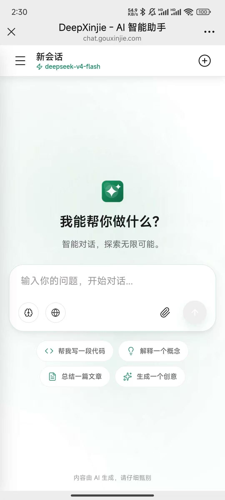
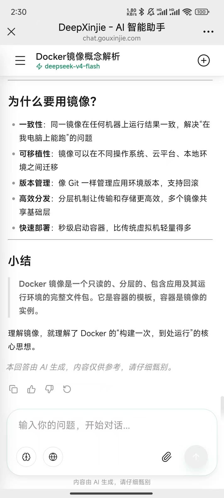

# DeepXinjie

一个前后端分离的 AI 聊天项目，前端基于 `React 19 + TypeScript + Vite`，后端基于 `FastAPI + MySQL`，整体产品形态参考企业级 AI 聊天网站（流式对话、深度思考、联网搜索等）。支持本地开发与 Docker 生产部署。

> 线上体验地址：<http://chat.gouxinjie.com/>

## 项目截图

### PC 端



---



---



---



### 移动端

<table>
  <tr>
    <td align="center"></td>
    <td align="center"></td>
    <td align="center"></td>
  </tr>
</table>

## 核心能力

### 账号与安全

- 账号密码注册与登录
- 基于 `Access Token + Refresh Token` 的登录态恢复与会话续期
- `CSRF Token` 校验与受保护接口访问
- 退出登录二次确认；`Refresh Token` / `CSRF Token` 仅以哈希形式存储
- 用户协议与隐私政策页（`/agreement`）

### 会话与消息

- 会话管理：新建、历史列表、重命名、置顶、删除
- 会话列表按「置顶 / 今天 / 7 天内 / 更早」自动分组
- AI 自动生成会话标题（首轮回复完成后调用大模型生成，无需手动命名）
- 会话与消息全文搜索（侧边栏搜索入口，结果跳转并高亮定位）
- 会话内消息锚点：快速跳转至任意用户消息

### 对话体验

- 流式聊天输出与中断生成（`fetch + SSE` 手动解析分片）
- 深度思考模式（`deepseek-v4-flash` + `thinking` 参数，记录思考耗时）
- 联网搜索与来源侧边栏展示（多条查询并发执行，含网页正文摘要抓取）
- 用户消息编辑后重新生成
- 基于上一轮消息继续生成（支持中断/失败消息续写）
- 消息状态机：生成中 / 已停止 / 已完成 / 失败，配合 `generation_id` 防误操作
- 首页快捷提问（写代码 / 解释概念 / 总结文章 / 生成创意）
- 首页背景光晕动画与欢迎语

### 本地缓存（IndexedDB）

- 会话、消息、草稿三级本地缓存，按 `user_id` 命名空间隔离多账号
- 进入会话秒级渲染本地数据，后台静默与服务端同步
- 流式过程中增量落盘，断网 / 刷新页面后可恢复未完成回答
- 输入草稿防抖持久化，切换会话自动恢复未发送内容

### 主题与适配

- 明暗主题切换
- 主色方案切换（蓝色经典 / 绿色默认）
- 桌面端与移动端双端适配，移动端侧边栏、来源面板等交互专项优化
- 移动端顶部栏展示模型名称与图标

## 技术栈

### 前端

- React 19 / TypeScript 5 / Vite 8 / React Router 7
- Axios / Zustand 5（`persist` 中间件持久化偏好）
- Sass / SCSS（CSS Modules 局部作用域）
- Radix UI（dialog / dropdown-menu / toast / tooltip）
- `framer-motion` 动画
- `react-markdown` + `remark-gfm` + `remark-math` + `rehype-highlight` + `rehype-katex`
- `mermaid` 图表渲染
- `lucide-react` 图标 / `clsx` + `tailwind-merge`

### 后端

- FastAPI / Uvicorn / MySQL 8
- `mysql-connector-python`（参数化查询）
- OpenAI Python SDK（DeepSeek 兼容，流式 + 非流式）
- `python-dotenv` / `pyjwt` / `passlib[bcrypt]`（固定 `bcrypt==4.0.1`）
- `requests` / `xmltodict`（联网搜索抓取）

## 目录结构

```text
.
├─ backend/                      # FastAPI 后端
│  ├─ main.py                    # 应用入口（CORS、路由挂载、统一异常、健康检查）
│  ├─ common.py                  # 公共工具（必填环境变量校验等）
│  ├─ db.py                      # MySQL 连接工具（连接池 + 参数化查询）
│  ├─ auth_utils.py              # JWT 签发/校验、密码哈希、CSRF 工具
│  ├─ init_db.py                 # 数据库初始化脚本
│  ├─ seed_user.py               # 体验用户初始化脚本
│  ├─ schema.sql                 # 数据库表结构
│  ├─ requirements.txt           # Python 依赖
│  ├─ Dockerfile                 # 后端镜像（python:3.11-slim）
│  ├─ routers/
│  │  ├─ auth.py                 # 注册、登录、刷新、退出、当前用户接口
│  │  └─ chat.py                 # 会话、消息、流式聊天、搜索接口
│  └─ services/
│     └─ search_service.py       # 联网搜索封装（并行搜索 + 正文摘要抓取）
├─ frontend/                     # React 前端
│  ├─ Dockerfile                 # 前端镜像（Vite 构建 + nginx 托管 + /api 反代）
│  ├─ deploy/nginx.conf          # 容器内 nginx 站点配置（SPA 回退 + /api 代理）
│  ├─ src/
│  │  ├─ components/
│  │  │  ├─ Chat/                # 聊天业务组件（ChatMain/ChatInput/ChatMessage/ChatSidebar 等）
│  │  │  ├─ commons/             # 公共组件（LoginModal/Mermaid/Modal/Toast/TypingIndicator）
│  │  │  ├─ Layout/              # 布局组件
│  │  │  └─ DeepXinjieLogo.tsx   # 独立组件
│  │  ├─ db/indexedDB.ts         # IndexedDB 薄封装（连接、事务、CRUD）
│  │  ├─ pages/                  # 页面（Login 登录页 / Agreement 协议页）
│  │  ├─ services/
│  │  │  ├─ api.ts               # 接口请求封装（axios + fetch SSE + 401 自动刷新）
│  │  │  └─ localCache.ts        # 本地缓存业务层（会话/消息/草稿读写）
│  │  ├─ store/                  # Zustand（authStore / sessionStore / themeStore）
│  │  ├─ styles/                 # 全局样式（variables/mixins/reset/global.scss）
│  │  ├─ types/                  # 类型定义（api.ts / chat.ts）
│  │  └─ utils/                  # 工具函数（cn、uuid 降级实现、useEvent 等）
│  └─ package.json
├─ deploy/                       # 生产部署
│  ├─ docker-compose.yml         # MySQL + 后端 + 前端三容器编排
│  ├─ server_chat.conf           # 宿主机 nginx 站点配置（示例）
│  └─ .env.example               # 生产环境变量模板
├─ .github/workflows/deploy.yml  # GitHub Actions 自动发布流水线
├─ images/                       # 项目截图
├─ doc/                          # 设计文档
├─ start.bat                     # Windows 一键启动脚本
└─ README.md
```

## 运行环境

- Node.js 20+（构建前端镜像需 Node 22+）
- Python 3.11+
- MySQL 8+

## 快速开始（本地开发）

### 1. 初始化数据库

```powershell
cd backend
python init_db.py
```

如需插入体验用户（演示账号 `13113183859` / `123456`），可执行：

```powershell
cd backend
python seed_user.py
```

### 2. 启动后端

```powershell
cd backend
python -m uvicorn main:app --host 127.0.0.1 --port 3601
```

或：

```powershell
cd backend
python main.py
```

### 3. 启动前端

```powershell
cd frontend
npm install
npm run dev -- --host 127.0.0.1 --port 3600
```

### 4. 一键启动

根目录执行 `start.bat`，脚本会自动清理占用 `3600/3601` 端口的旧进程，并先后启动前后端、等待后端就绪。

## 访问地址

- 前端开发地址：`http://127.0.0.1:3600`
- 后端开发地址：`http://127.0.0.1:3601`
- 后端健康检查：`http://127.0.0.1:3601/api/hello`

## 环境变量

后端通过 `python-dotenv` 读取环境变量，本地开发在 `backend/.env` 中配置，生产部署在服务器部署目录的 `.env` 中配置（模板见 `deploy/.env.example`）。

### 必填

```env
DB_PASSWORD=你的数据库密码
JWT_SECRET=你的JWT密钥
```

### 常用可选项

```env
DB_HOST=localhost
DB_USER=root
DB_NAME=chat_platform

DEEPSEEK_API_KEY=你的DeepSeek密钥
DEEPSEEK_BASE_URL=https://api.deepseek.com

SEARCH_PROVIDER=tavily
TAVILY_API_KEY=你的Tavily密钥
SEARCH_TIMEOUT_SECONDS=10
SEARCH_MAX_RESULTS=5
SEARCH_FETCH_PAGE_CONTENT=false
SEARCH_PAGE_TIMEOUT_SECONDS=6

ACCESS_TOKEN_EXPIRE_MINUTES=15
REFRESH_TOKEN_EXPIRE_DAYS=7
COOKIE_SECURE=false
COOKIE_SAMESITE=lax
CORS_ORIGINS=http://localhost:3600,http://127.0.0.1:3600
```

说明：

- `DB_PASSWORD` 和 `JWT_SECRET` 缺失时，后端会在启动阶段直接报错。
- `ACCESS_TOKEN_EXPIRE_MINUTES` 控制短效 `Access Token` 时长。
- `REFRESH_TOKEN_EXPIRE_DAYS` 控制 `Refresh Token` 会话时长。
- `COOKIE_SECURE=true` 时要求使用 HTTPS 环境。
- `CORS_ORIGINS` 为逗号分隔的跨域白名单，缺省时回退到本地开发地址。
- 纯 HTTP 部署必须保持 `COOKIE_SECURE=false`，否则浏览器不会保存 Cookie 导致登录态丢失。

## 前端脚本

```powershell
cd frontend
npm install
npm run dev
npm run build
npm run lint
npm run preview
```

## 认证与会话机制

- 登录或注册成功后：
  - 后端返回短效 `accessToken`
  - 后端同时写入 `HttpOnly refresh_token Cookie`
  - 后端同时写入 `csrf_token Cookie`
- 前端将 `accessToken` 保存在 Zustand 内存状态中
- 页面刷新后，前端会自动调用 `/api/auth/refresh` 恢复登录态
- 前端收到 `401` 时优先自动刷新并重放原请求，刷新失败再跳转登录页
- `refresh_token` 不暴露给前端 JavaScript，主要用于续期
- `csrf_token` 用于前端回填请求头（`X-CSRF-Token`），配合后端进行 `CSRF` 校验
- 所有会改变状态的请求（`POST` / `PUT` / `DELETE` 等）均携带 `X-CSRF-Token`

## 本地缓存机制

前端通过 IndexedDB（数据库名 `deepxinjie_cache`）提供离线体验：

- 三个对象仓储：`messages`（消息）、`sessions`（会话）、`drafts`（草稿）
- 所有缓存按 `user_id` 命名空间隔离，避免多账号串数据
- 会话列表 / 消息列表优先本地秒级渲染，随后静默与服务端同步
- 流式回答在结束 / 中断 / 出错时统一落盘，刷新后可恢复完整内容
- 输入内容防抖写入草稿，发送成功后清除

## 后端接口概览

### 认证相关

- `POST /api/auth/register`：账号注册
- `POST /api/auth/login`：账号密码登录
- `POST /api/auth/refresh`：刷新 Access Token
- `GET /api/auth/me`：获取当前用户信息
- `POST /api/auth/logout`：退出登录

### 聊天相关

- `POST /api/chat/send`
  - 鉴权保护的流式聊天接口（SSE）
  - 支持 `is_deepthink`、`is_search`、`session_id`、`continue_from_message_id`（基于上一轮继续生成）
  - 首轮回复完成后自动生成会话标题，通过流内分片推送 `title`
- `GET /api/chat/sessions`：获取当前用户会话列表
- `POST /api/chat/sessions`：创建会话
- `PUT /api/chat/sessions/{session_id}`：重命名会话
- `PUT /api/chat/sessions/{session_id}/pin`：切换置顶状态
- `DELETE /api/chat/sessions/{session_id}`：删除会话
- `GET /api/chat/sessions/{session_id}/messages`：获取会话消息列表
- `PUT /api/chat/messages/{message_id}`：编辑用户消息
- `DELETE /api/chat/sessions/{session_id}/messages`：删除某条消息之后的记录
- `POST /api/chat/messages/{message_id}/stop`：停止生成
- `GET /api/chat/search`：搜索当前用户的会话标题与消息内容（按会话分组、倒序排列）

## Docker 部署（生产）

### 镜像构建

```powershell
# 后端镜像（构建上下文为仓库根目录）
docker build -f backend/Dockerfile -t deepxinjie-api .

# 前端镜像
docker build -f frontend/Dockerfile -t deepxinjie-web .
```

### 容器编排

`deploy/docker-compose.yml` 定义三个服务：

- `db`：MySQL 8.0，仅在容器内网访问，首次启动自动执行 `schema.sql` 建表，数据持久化到数据卷
- `api`：FastAPI 后端，监听 `3601`，启动前等待数据库健康
- `web`：nginx 托管前端静态资源，仅绑定回环地址 `127.0.0.1:3610`，避免与宿主 80 端口冲突

服务器部署步骤：

```bash
# 1. 在部署目录准备环境变量（参考 deploy/.env.example）
cp deploy/.env.example /var/www/chat/.env && chmod 600 /var/www/chat/.env
# 2. 编辑 .env 填入 REGISTRY / NAMESPACE / IMAGE_TAG / DB_PASSWORD / JWT_SECRET 等
# 3. 将 deploy/docker-compose.yml 与 backend/schema.sql 放到同一目录
# 4. 启动
docker compose pull && docker compose up -d
```

宿主机 nginx 站点配置参考 `deploy/server_chat.conf`：将域名（如 `chat.gouxinjie.com`）80 端口流量转发到 `127.0.0.1:3610`，并关闭缓冲保证流式输出逐块透传。

### 自动发布（GitHub Actions）

`.github/workflows/deploy.yml` 在 `push` 到 `main` 分支（或手动触发）时自动执行：

1. 构建前后端镜像，推送阿里云 ACR（以 commit sha 作为镜像版本）
2. SSH 登录 ECS，同步编排文件、更新 `IMAGE_TAG`、拉取镜像并滚动重启
3. 执行健康检查（`curl /api/hello`），失败时退出并提示查看容器日志

所需 Secrets：`ACR_USERNAME`、`ACR_PASSWORD`、`ECS_HOST`、`ECS_USER`、`ECS_SSH_KEY`、`ECS_PORT`。

## 当前实现细节

### 前端

- 所有接口请求统一封装在 `frontend/src/services/api.ts`，禁止组件直写请求地址
- 流式聊天使用 `fetch + POST` 手动解析 SSE 分片（EventSource 不支持 POST 与自定义请求头）
- 401 场景下优先自动刷新登录态并重放请求
- 路由级组件懒加载，拆分 `react-markdown` / `mermaid` 等重型依赖
- 列表渲染使用稳定引用（`useEvent`）与 rAF 节流，避免滚动卡顿
- 纯 HTTP 环境使用 UUID 降级实现，兼容无 `crypto.randomUUID` 的场景

### 后端

- 所有接口响应统一使用 `success / code / message / data` 结构
- 刷新会话保存在 `user_session` 表中，`Refresh Token` 与 `CSRF Token` 以哈希形式保存
- 所有查询使用参数化查询，禁止拼接 SQL
- 登录不再自动注册，必须显式调用注册接口
- 启动阶段自动执行幂等的建表 / 补列逻辑
- 联网搜索多查询并发执行、正文摘要并发抓取，降低首字延迟
- 深度思考统一使用 `deepseek-v4-flash` + `thinking` 参数（旧 `deepseek-reasoner` 别名已于 2026-07-24 停用）

## 已知说明 / 进行中功能

- 文件上传：`file_upload` 表结构已存在，前端「上传文件」入口已加，完整链路开发中
- 系统设置：侧边栏入口已加，点击提示「功能开发中」
- 分享会话：顶部栏入口已加，点击提示「功能开发中」
- 当前项目尚未补齐完整自动化测试
- 前端生产构建仍会出现较大的 bundle 提示，但不影响本地开发与基础构建

## 文档

更多设计文档位于 `doc/` 目录：

- `需求文档.md`
- `登录态正规方案设计.md`
- `联网搜索实现方案.md`
- `停止生成与继续生成方案设计.md`
- `AI自动生成会话标题.md`
- `IndexedDB本地缓存方案设计.md`
- `部署指南.md`

## 最近验证

最近已验证通过：

```powershell
cd backend
python -m compileall backend
```

```powershell
cd frontend
npm run build
```

## 仓库地址

- GitHub：`https://github.com/gouxinjie/deepxinjie`

## License

本项目采用 `MIT License`，详见 [LICENSE](./LICENSE)。
